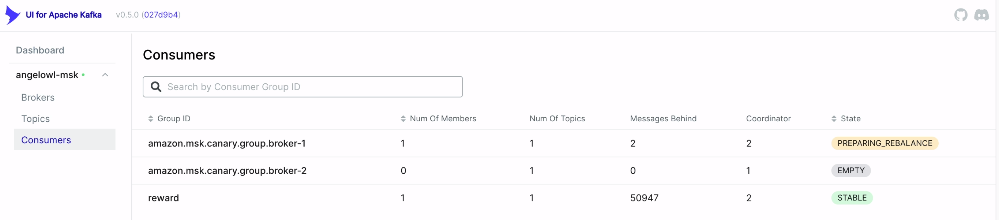
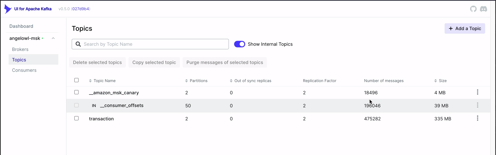
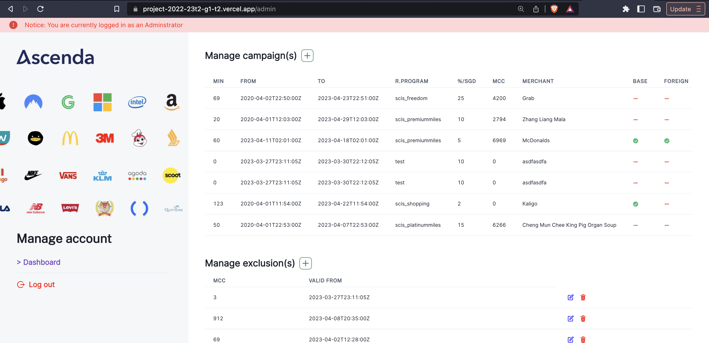
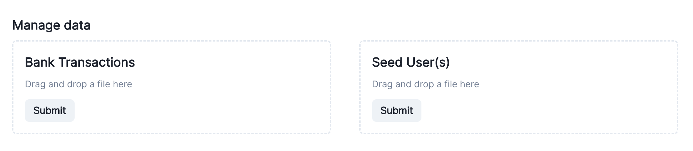

# AngelOwl Loyalties

<table style="width: 100%; border: none;" cellspacing="0" cellpadding="0" border="0">
  <tr>
    <td></td>
    <td></td>
    <td></td>
    <td></td>
    <td></td>
    <td></td>
    <td></td>
    <td></td>
    <td></td>
    <td></td>
  </tr>
</table>

## Team Members

[Aw Khai Loong](https://github.com/awwkl)

[Goh Wen Liang](https://github.com/wenlianggg)

[Lam Xi Kai Justin](https://github.com/iPhantasmic)

[Lye Jian Yi](https://github.com/lyejy)

[Omer Wai Yan Oo](https://github.com/omerwyo)

[Ong Chi Kiat Nicholas](https://github.com/oversparkling)

[Owyong Jian Wei](https://github.com/alvinowyong)

## Directory Structure

As we have followed a monorepo strategy, you'll find one folder for each service. The following folders are not directly related to a service but are crucial to our deployments

- .charts
    - These consist of Helm charts that are used in our Github Action for deployment. This folder specifies yamls that describe our Kubernetes resources, secrets and others so we can declare how we want our cluster to look like at the end of a deployment.
- .github/workflows
    - This file consists of 2 reusable workflows, `workflow_container.yml` and `workflow_lambda.yml`, and `ci_` files that reference the worflows. These CI files help automate our CI/CD pipeline, from linting to auto-deploying to production.
    - Some miscellaneous files include a yaml for sending notifications to our Telegram group when a PR or a code review is submitted
- .infra
    - Consists of all the Terraform files that declare the goal state of our deployments. One could use the Terraform commands `init`, `plan`, `apply`/`destroy` to make changes to our deployed infrastructure on AWS.
- docs
    - This folder stores some images for documentation purposes

The remaining folders are either containerised services, or containerised lambdas that we will explore in the next section.

## Microservices Architecture

Here we cover the functionality each service/lambda serves and how they could be deployed.

Every subdirectory mentioned can be deployed locally as a container, and one could do this using a docker-compose file at the root of the repository. The Dockerfile and the corresponding docker-compose at each subdirectory provides a good reference on how this can be done.

### Containerised Services
---
For all non-lambda services, a sample `.env` file can be found at `/config/dev.env`. A `.env` file with your own environment variables could be used to pass in relevant values into the docker-compose file.
- Campaignex
    - This service uses the REST framework Gin, exposing CRUD operations for merchant managers to create and manage Campaigns and Exclusions. This service is responsible to write these into etcd, as well as its own PostgreSQL database as a layer of redundancy, or for auditing needs.
- Rewarder
    - This service isn’t a REST API, but acts as an orchestrator to process transactions it consumes from Kafka and to determine the appropriate reward a transaction will receive. It is also responsible for writing these processed transactions into the Cassandra database.
- Informer
    - This service uses the REST framework Gin, exposing Read operations that the frontend web client calls to retrieve the rewards history pertaining to a requested card from the Cassandra database.
- Profiler
    - This service uses the REST framework Gin, exposing CRUD operations on User and Customer information. The frontend and some other services call on this service to obtain user data.

### Lambdas
---
For all lambda services, an `.env.example` is provided to the same effect. For lambda services, the Dockerfiles and the corresponding docker-compose.yml follow AWS' guide on deploying lambdas locally so that they replicate the behaviour of production Lambdas, using AWS Lambda Runtime Interface Emulator (RIE). The AWS Lambda RIE is a proxy for the Lambda Runtime API that allows you to locally test your Lambda function packaged as a container image.

The lambdas are 
- Authorizer
    - A serverless function to 
- Rewarder
    - This service isn’t a REST API, but acts as an orchestrator to process transactions it consumes from Kafka and to determine the appropriate reward a transaction will receive. It is also responsible for writing these processed transactions into the Cassandra database.
- Informer
    - This service exposes an API that the frontend web client calls to retrieve the rewards history pertaining to a requested card from the Cassandra database.
- Profiler
    - This service exposes REST API endpoints to perform CRUD operations on User and Customer information. It allows a customer to obtain information on their user profile as well as the cards in their ownership.

Ingestor is a lambda that ingests a CSV file from S3 and parses rows and acts as a producer to into Kafka.

### Frontend
---

- The 

## Images

### Kafka UI - Consumer Group `reward`

This screenshot shows the number of messages the cluster of rewader service pods is yet to consume.

### Kafka UI - Topic `transaction`

This screenshot shows the number of messages present in the topic of concern: `transaction`

### Web App UI - Admin View

This screenshot shows the main page of UI where admin can view prevailing campaigns and exclusions, and add their own

### Web App UI - Upload files

This screenshot shows a part of the admin portion of the UI where admins can drop bulk transaction CSV, or add users via a CSV.

